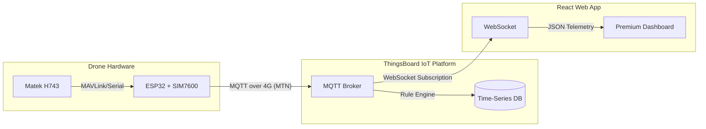

# 🛠 Developer Documentation: UAV Cloud Telemetry Dashboard

Welcome to the internal engineering guide for the **MP-08 Drone Telemetry Dashboard**. This document provides a technical deep dive into the system architecture, data flow, and development practices used in this project.

---

## 🏗 System Architecture (The "Big Picture")

The system is designed to bypass the range limitations of traditional RF links by using a **4G/LTE cellular pipeline**.



### 1. The Telemetry Pipeline
1.  **Ingestion:** The **ESP32** bridges serial data from the Flight Controller to the cloud via **MQTT**. It uses a SIM7600 module for 4G connectivity.
2.  **Processing:** **ThingsBoard** acts as the central hub, handling device authentication, telemetry storage, and automated rules (e.g., low battery alarms).
3.  **Consumption:** The **Dashboard** establishes a real-time WebSocket connection to ThingsBoard to receive updates sub-100ms.

---

## 💻 Frontend Architecture

The dashboard is a heavy-duty React application built for high-performance geospatial tracking and data visualization.

### 🔌 Real-Time Data Flow (WebSocket)
The application core (`App.tsx`) manages a persistent WebSocket connection.
- **Handshake:** Uses ThingsBoard JWT tokens for authentication.
- **Subscription:** Sends a `tsSubCmds` message to subscribe to the `LATEST_TELEMETRY` of a specific `deviceId`.
- **State Management:** Incoming data is parsed and distributed to three primary state buckets:
    - `telemetry`: The most recent single reading.
    - `path`: An array of `[lat, lng]` coordinates (limited to 300 points) for breadcrumb rendering.
    - `history`: A rolling window of historical data (50 points) for graph plotting.

### 🗺️ Component Breakdown
| Component | Functionality | Key Technology |
| :--- | :--- | :--- |
| **DroneMap** | Renders 2D positioning and the live flight path trail. | `React-Leaflet` |
| **TelemetryCharts** | Visualizes Speed and Altitude efficiency trends. | `Recharts` |
| **StatusWidgets** | Premium cards for battery, signal, and AGL altitude. | `Vanilla CSS` |
| **Login** | Handles JWT generation via ThingsBoard REST API. | `Fetch API` |

---

## 📋 Data Contract (Canonical Schema)

All telemetry entering the system must adhere to this deterministic contract:

```typescript
{
  latitude: number;   // WGS84 decimal format
  longitude: number;  // WGS84 decimal format
  altitude: number;   // Altitude Above Ground Level (m)
  speed: number;      // Ground speed (m/s)
  battery: number;    // Voltage (e.g., 16.8 for 4S full)
  signal: number;     // RSSI in dBm or percentage
  status: string;     // Operational status (e.g., "Armed", "FAILSAFE")
}
```

---

## 🎨 UI/UX & Aesthetics

The dashboard adheres to a **"Cyber-Industrial"** aesthetic:
- **Color Palette:** Deep slate backgrounds (`#0f172a`), vivid blues (`#38bdf8`), and indigo accents.
- **Glassmorphism:** Subsystem panels use `backdrop-filter: blur(12px)` for a premium, layered feel.
- **Dynamic Feedback:** Status indicators use CSS animations (`pulseGlow`) to represent heartbeat and connectivity states.

---

## 🛠 Developer Setup

### Prerequisites
- Node.js (v18+)
- A ThingsBoard account (Cloud or Professional)
- A valid Device ID from your TB instance

### Environment Configuration (`.env`)
Create a file at `dashboard/.env`:
```bash
VITE_DRONE_DEVICE_ID=your-device-uuid
VITE_THINGSBOARD_WS_URL=wss://thingsboard.cloud/api/ws/plugins/telemetry
VITE_THINGSBOARD_REST_URL=https://thingsboard.cloud
VITE_DASHBOARD_JWT_TOKEN=optional-hardcoded-token
```

### Development Commands
```bash
# Install dependencies
npm install

# Start interactive development server
npm run dev

# Build for production (optimized output)
npm run build
```

---

## 🚀 Roadmap for Developers
- [ ] **Multi-Drone Support:** Abstract the state management to handle multiple WebSocket entity IDs.
- [ ] **Command Downlink:** Implement MQTT RPC calls through the UI for dynamic waypoint injection.
- [ ] **Offline Maps:** Implement PWA capabilities and Tile caching for field operations.
